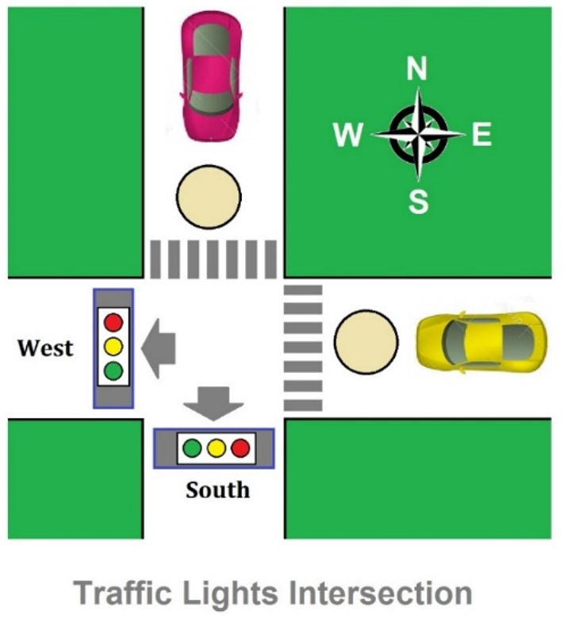

# verilog_traffic_light
Implementation of a 4-way traffic control system with verilog on artix-7 fpga

design a state machine for the traffic lights at a simple four-way intersection with pedestrian crosswalks. Here is the problem description for the FSM:

    The intersection that you are controlling is composed of two sets of lights for cars and one set of lights for pedestrians. The car lights control vehicle movements in either the east-west direction or the north-south, while the pedestrian lights control movement for pedestrians moving in all directions.
    There are eight lights to operate. The red, yellow, and green lights in the north-south direction will be designated as R1, Y1, G1. Similarly, the lights in the east-west direction will be called R2, Y2, and G2. There are red and green lights for the pedestrian, and you can name them as R3 and G3.
    The car lights should cycle through their state such that the green light is on for 1 seconds, the yellow light is on for ~0.5 second, and the red light is on for at least 1.5 seconds at a time.
    If a pedestrian pushes a button, then the pedestrian green light will be enabled only after the car light that is currently in either the green state or the yellow state finishes its state sequence and becomes red. In other words, the push button will not immediately turn the car lights to red but will rather wait until the car lights eventually return to red. The pedestrian button will be generated on the PC side and transmitted to the FPGA via OKWireIns.
    The pedestrian green light will be on for 1 seconds. After this sequence, the car lights have to continue from where they left off before the button was pressed. If the north-south signal was green before the pedestrian light was on, then after the pedestrian light has gone through its green state to its red state, the east-west signal should turn to green.

